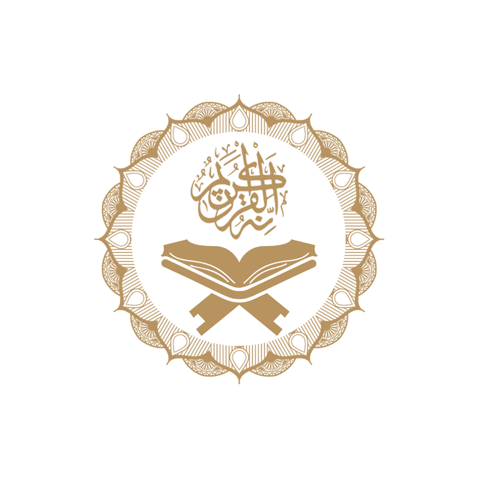

# Islamic App 📿

<div align="center">
  

[](https://flutter.dev)
[](https://dart.dev)
[](LICENSE)
</div>

## 📖 Overview

**Islamic App** is a comprehensive mobile application built with Flutter that provides Muslims with essential Islamic resources in one place. The app features Quran reading, Hadith collection, digital Tasbih (prayer beads), live Islamic radio stations, and customizable settings for theme and language preferences.

The application is designed with a clean, user-friendly interface that supports both English and Arabic languages, along with light and dark theme modes to enhance user experience.

---

## 🚀 Tech Stack

### **Frontend**
- **Flutter SDK**: `3.35.5`
- **Dart**: `^3.9.2`

### **State Management**
- **Provider**: `^6.1.5+1` - For efficient state management across the app

### **UI/UX**
- **flutter_screenutil**: `^5.9.3` - Responsive screen adaptation
- **google_fonts**: `^6.3.2` - Custom typography
- **flutter_native_splash**: `^2.4.6` - Native splash screens

### **Localization**
- **flutter_localizations** - Built-in internationalization
- **intl** - Date/time formatting and localization

### **Data & Storage**
- **shared_preferences**: `^2.5.3` - Local data persistence
- **http**: `^1.5.0` - API communication

### **Media**
- **audioplayers**: `^6.5.1` - Audio streaming for radio functionality

---

## 🏗️ Architecture

The project follows a **clean architecture** pattern with clear separation of concerns:

```
lib/
├── core/                      # Core utilities and configurations
│   ├── cache/                 # Local storage management
│   ├── constants/             # App-wide constants (images, strings)
│   └── style/                 # Theme and styling
│
├── feature/                   # Feature-based modules
│   ├── quran/                 # Quran reading functionality
│   │   ├── data/              # Data layer (models, data sources)
│   │   └── presentation/      # UI layer (screens, widgets)
│   │
│   ├── hadeth/                # Hadith collection
│   │   ├── model/
│   │   ├── view/
│   │   └── view_model/
│   │
│   ├── sebha/                 # Digital Tasbih counter
│   │   ├── view/
│   │   └── view_model/
│   │
│   ├── radio/                 # Islamic radio streaming
│   │   ├── model/
│   │   ├── view/
│   │   └── view_model/
│   │
│   ├── settings/              # App settings
│   │   ├── view/
│   │   └── view_model/
│   │
│   └── home/                  # Main navigation
│       └── view/
│
├── l10n/                      # Localization files
│   ├── app_ar.arb            # Arabic translations
│   ├── app_en.arb            # English translations
│   └── app_localizations.dart
│
└── main.dart                  # App entry point
```

### **Design Patterns Used**
- ✅ **Provider Pattern** - State management
- ✅ **Repository Pattern** - Data abstraction
- ✅ **Factory Pattern** - Model creation
- ✅ **Singleton Pattern** - Cache helper

---

## ✨ Features

### 📚 **Quran Reader**
- Complete Quran with 114 Surahs
- Verse-by-verse navigation
- Arabic text display
- Verse count indicator
- Detailed Surah view

### 📜 **Hadith Collection**
- Curated collection of authentic Hadiths
- Easy browsing interface
- Full Hadith text display
- Category-based organization

### 📿 **Digital Sebha (Tasbih)**
- Interactive prayer counter
- Multiple Dhikr phrases:
    - سبحان الله (Subhan Allah)
    - الحمدلله (Alhamdulillah)
    - الله أكبر (Allahu Akbar)
    - لا إله إلا الله (La ilaha illallah)
- Animated rotation effect
- Auto-reset after 33 counts
- Visual counter display

### 📻 **Islamic Radio**
- Live streaming from multiple Islamic radio stations
- Fetches channels from MP3Quran API
- Play/Pause controls
- Swipe navigation between stations
- Real-time audio playback

### ⚙️ **Settings**
- **Language Support**:
    - 🇬🇧 English
    - 🇸🇦 Arabic (RTL support)
- **Theme Modes**:
    - ☀️ Light Mode
    - 🌙 Dark Mode
- Persistent settings with SharedPreferences

### 🎨 **UI/UX Features**
- Responsive design (adapts to all screen sizes)
- Beautiful splash screens (light & dark variants)
- Smooth animations and transitions
- Custom bottom navigation
- Context-aware theming

---

## 🧪 Testing

The project includes a basic testing setup:

```dart
test/
└── widget_test.dart   # Widget testing framework
```

### **Running Tests**
```bash
flutter test
```

---

## 📁 Folder Structure

<details>
<summary>Click to expand detailed structure</summary>

```
islamic_app/
│
├── android/                   # Android-specific files
├── ios/                       # iOS-specific files
├── web/                       # Web-specific files
├── macos/                     # macOS-specific files
├── linux/                     # Linux-specific files
├── windows/                   # Windows-specific files
│
├── assets/
│   ├── images/               # App images and icons
│   └── files/                # Quran & Hadith text files
│
├── lib/
│   ├── core/
│   │   ├── cache/
│   │   │   └── cache_helper.dart
│   │   ├── constants/
│   │   │   └── app_images.dart
│   │   └── style/
│   │       ├── colors.dart
│   │       └── themes.dart
│   │
│   ├── feature/
│   │   ├── quran/
│   │   │   ├── data/
│   │   │   │   ├── suras_names.dart
│   │   │   │   └── sura_data.dart
│   │   │   └── presentation/
│   │   │       ├── screen/
│   │   │       └── widget/
│   │   │
│   │   ├── hadeth/
│   │   ├── sebha/
│   │   ├── radio/
│   │   ├── settings/
│   │   └── home/
│   │
│   ├── l10n/
│   └── main.dart
│
├── test/
├── .gitignore
├── analysis_options.yaml
├── flutter_native_splash.yaml
├── l10n.yaml
├── pubspec.yaml
└── README.md
```

</details>

---

## 🚀 How to Run the Project

### **Prerequisites**
- Flutter SDK `>=3.9.2`
- Dart SDK `>=3.9.2`
- Android Studio / VS Code
- Android Emulator / iOS Simulator / Physical Device

### **Installation Steps**

1. **Clone the repository**
   ```bash
   git clone https://github.com/Mohmdhamad/islamic_app.git
   cd islamic_app
   ```

2. **Install dependencies**
   ```bash
   flutter pub get
   ```

3. **Generate localization files**
   ```bash
   flutter gen-l10n
   ```

4. **Generate splash screens**
   ```bash
   flutter pub run flutter_native_splash:create
   ```

5. **Run the app**
   ```bash
   flutter run
   ```

### **Build for Production**

**Android APK**
```bash
flutter build apk --release
```

**iOS IPA**
```bash
flutter build ios --release
```

**Web**
```bash
flutter build web --release
```

---

## 🔮 Future Improvements

- [ ] **Prayer Times** - Add automatic prayer time notifications based on location
- [ ] **Qibla Compass** - Integrate compass to find prayer direction
- [ ] **Bookmarks** - Save favorite verses and Hadiths
- [ ] **Audio Quran** - Add Quran recitation with multiple reciters
- [ ] **Search Functionality** - Search within Quran and Hadith
- [ ] **Daily Notifications** - Random verses and Hadiths
- [ ] **Offline Mode** - Full offline functionality
- [ ] **Social Sharing** - Share verses on social media
- [ ] **Progress Tracking** - Track reading progress
- [ ] **Multiple Translations** - Add Quran translations in various languages
- [ ] **Islamic Calendar** - Hijri calendar integration
- [ ] **Dua Collection** - Comprehensive collection of daily supplications

---

## 📸 Screenshots

<div align="center">

### Light Theme


### Dark Theme


</div>

> **Note**: Add actual app screenshots here once available

---

## 👨‍💻 Developer

**Mohammed Hamad**

Feel free to reach out for collaboration or questions!

---

## 📄 License

This project is private and not intended for public distribution.

---

## 🙏 Acknowledgments

- **MP3Quran API** - For providing Islamic radio streams
- **Flutter Community** - For excellent packages and support
- **Islamic Scholars** - For verified Hadith collections

---

<div align="center">

**Made with ❤️ for the Muslim community**

</div>